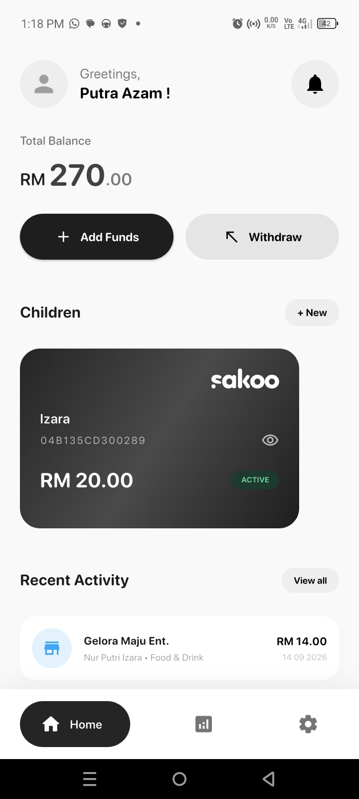
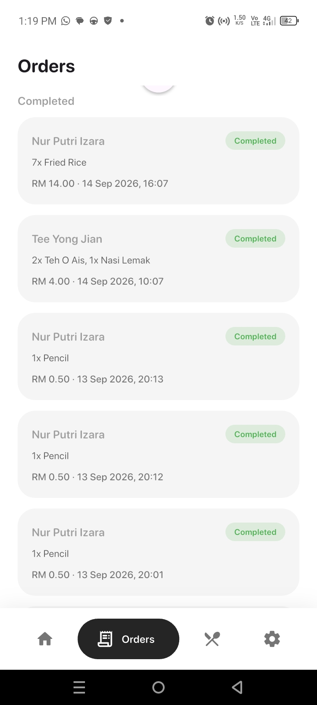
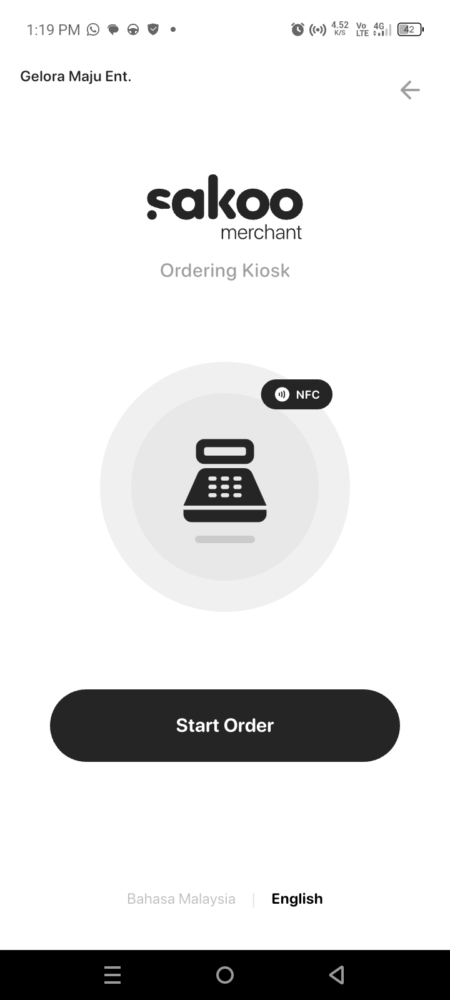
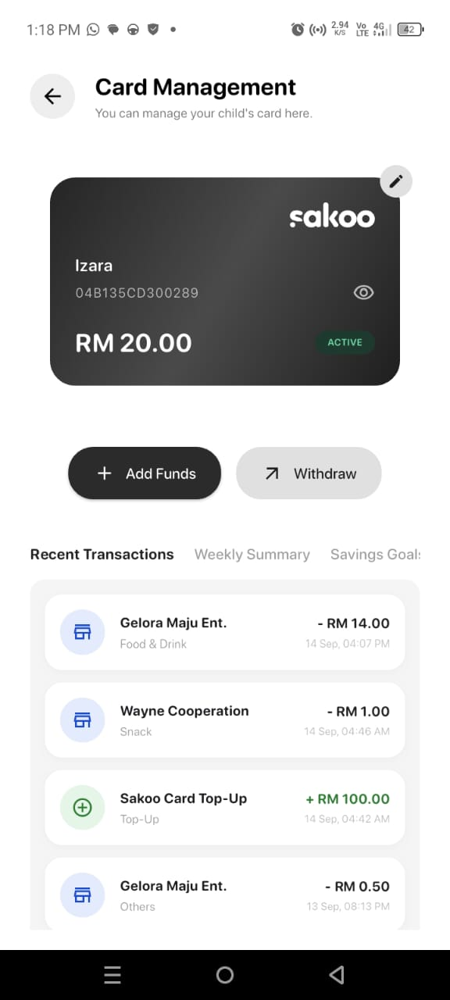
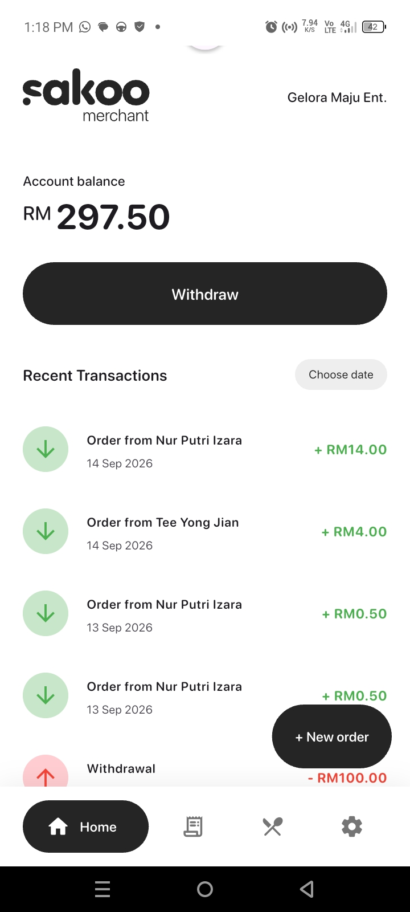
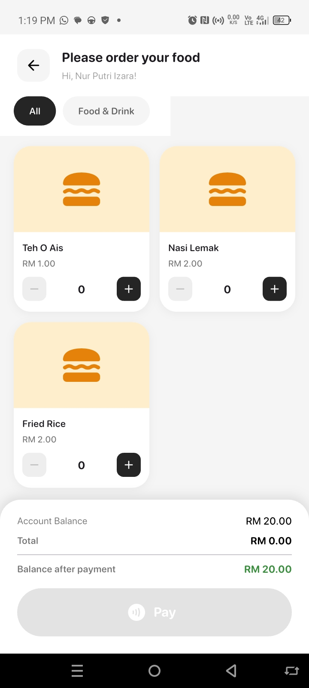

# Sakoo

Sakoo is a digital allowance management application for Malaysian school children. It replaces physical cash allowance with an NFC card system, giving parents visibility and control over how their children spend, while giving school canteen merchants a simple point-of-sale and ordering workflow.

## Overview

Each child is issued an NFC card linked to a digital balance managed by their parent. Parents top up the card, set daily spending limits, freeze the card if needed, and set up savings goals. Children tap their card at a merchant's kiosk or counter to pay for food and drinks; the transaction is deducted from their balance in real time and reflected instantly on both the parent's and merchant's side of the app.

The application is built with a single Flutter codebase serving three roles:

- **Parent** — manages children, cards, balances, limits, and savings goals.
- **Merchant** — manages a menu, takes orders (in person or via a self-service kiosk), and tracks order status.
- **Kiosk** — a self-service ordering screen for children, tied to a merchant's own menu and account.

## Screenshots

<!-- Replace the placeholder paths below with your own screenshots.
     Save your images under docs/screenshots/ and keep the same file names,
     or update the paths here to match whatever you name them. -->

| Parent | Merchant | Kiosk |
|---|---|---|
|  |  |  |
|  |  |  |

## Tech Stack

- **Flutter** — cross-platform client (Android, iOS, Web)
- **GetX** — state management, dependency injection, and navigation
- **Supabase** — Postgres database, authentication data, Row Level Security, Realtime subscriptions, and RPC functions for atomic balance transfers
- **flutter_nfc_kit** — NFC card scanning for both the kiosk and merchant checkout flows

> Note: `flutter_bloc`, `firebase_core`, `cloud_firestore`, and `firebase_auth` remain listed in `pubspec.yaml` from an earlier iteration of the project. The application has since been fully migrated to GetX and Supabase; these packages are no longer used in the codebase and can be removed.

## Features

### Parent Module
- Dashboard with total balance overview and recent activity
- Add and manage multiple children, each with their own NFC card
- Link/unlink an NFC card to a child's profile
- Top up or withdraw a child's card balance
- Set and update a child's daily spending limit
- Freeze/unfreeze a child's card
- Savings goals — set aside money from a child's own balance toward a target, with the ability to cash out once the goal is reached
- Transaction history per child, with a weekly spending summary
- Add funds to the parent's own wallet
- Profile and account settings

### Merchant Module
- Dashboard with balance and recent order overview
- Menu management — add, edit, remove, and toggle availability of items
- Manual order entry with NFC checkout (for orders taken at the counter)
- Order tracking — incoming orders appear as pending, with the ability to mark them completed or cancelled
- Kiosk Mode — turn the current session into a self-service kiosk for the merchant's own store, without a separate login
- Account settings

### Kiosk
- NFC tap-to-identify flow for the child placing an order
- Live menu synced to the merchant's own item list, including real-time updates when the merchant adds, edits, or removes an item
- Daily spending limit and frozen-card checks enforced at the point of payment
- Bilingual interface (English / Bahasa Malaysia)

### Planned / In Progress
- Admin role and management module
- Expanded merchant analytics
- Hardening of authentication and session handling using Supabase Auth
- General UI/UX and codebase refinements

## Project Structure

```
lib/
├── controllers/       # GetX controllers (business logic, state)
├── models/             # Data models (Child, Goal, Transaction, Merchant, Parent, Card)
├── screens/
│   ├── auth/            # Login, signup
│   ├── kiosk/            # Kiosk idle and ordering screens
│   ├── merchant/         # Merchant dashboard, menu, orders, checkout, settings
│   ├── parent/            # Parent dashboard, child management, goals, analytics
│   └── welcome_screen.dart
├── services/            # Session persistence
└── main.dart
```

## Database

Sakoo uses Supabase (PostgreSQL) with the following core tables:

| Table | Purpose |
|---|---|
| `user` | Shared table for parent, merchant, and admin accounts |
| `child` | Child profiles, card linkage, balance, and spending limits |
| `card` | Physical NFC card records |
| `transaction` | All balance movements: purchases, top-ups, withdrawals |
| `item` | Merchant menu items |
| `goal` | Child savings goals |

Balance transfers (card top-ups, NFC payments, and goal contributions) are handled through Postgres RPC functions to keep each operation atomic. Realtime subscriptions are used to keep the kiosk menu and merchant order list in sync without manual refreshing.

Authentication is also handled through dedicated RPC functions rather than direct table queries, so password hashes are never read or written by the client directly:
- `register_user` — creates an account with the password hashed using bcrypt (`pgcrypto`) before it is stored
- `verify_login` — checks the submitted password against the stored hash inside the database and returns only non-sensitive account fields (no password/hash is ever returned to the client)

## Getting Started

### Prerequisites
- Flutter SDK (see `environment.sdk` in `pubspec.yaml`)
- A Supabase project with the schema above set up
- An Android/iOS device or emulator with NFC support for testing card-related features

### Setup

1. Clone the repository
   ```
   git clone <repository-url>
   cd sakoo
   ```

2. Install dependencies
   ```
   flutter pub get
   ```

3. Configure Supabase

   The Supabase URL and publishable key are currently set directly in `lib/main.dart`. Replace these with your own project's credentials, or refactor to load them from environment variables/a `.env` file before committing to a shared or public repository.

4. Run the app
   ```
   flutter run
   ```

## Known Limitations

- Login and registration still use a custom `user` table rather than Supabase Auth, so session handling (timeouts, refresh tokens, etc.) is managed manually via local session storage instead of Supabase's built-in auth session lifecycle. Passwords themselves are hashed with bcrypt and never handled in plaintext by the client (see Database section above).
- Row Level Security policies on several tables are intentionally permissive during development (e.g. `USING (true)`) and should be tightened before production use — this includes restricting direct read access to the `user` table, which the authentication RPCs above no longer require.
- The admin role is defined in the schema but has no dedicated interface yet.

## License

No license has been specified for this project.